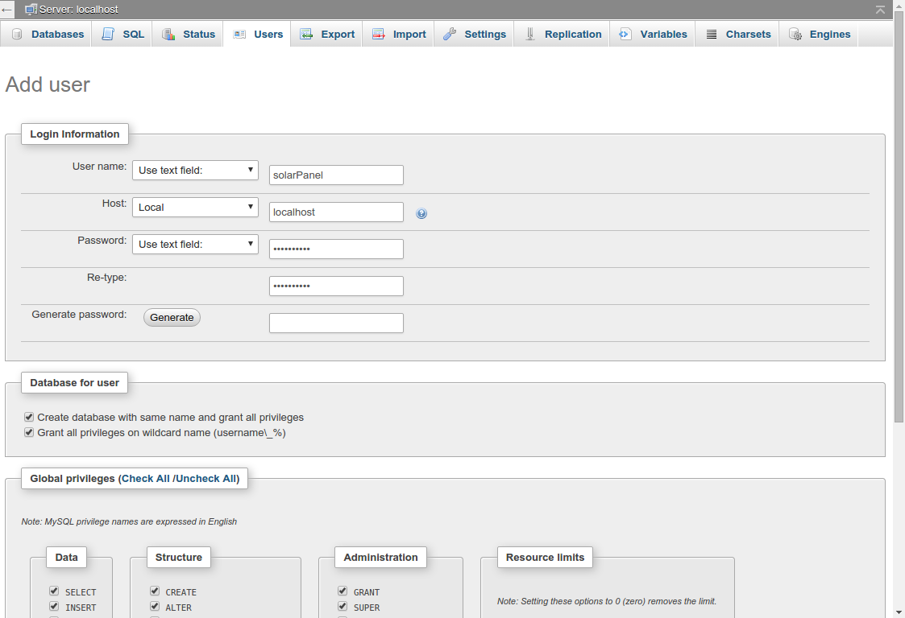

# bananapi

My Banana Pi Projects. More Information at 
<a href="http://kingofprotons.blogspot.com">Maker Projects</a>

<h3>Installation - Common to all projects</h3>

Download Lubuntu image from <a href="http://www.lemaker.org/product-bananapro-resource.html">LeMaker Resource Downloads</a>

user is bananapi
password is bananapi

install LAMP server:

sudo apt-get install tasksel

sudo tasksel

sudo apt-get install phpmyadmin

<h3>Installation - power monitor</h3>

create user and database named solarPanel

point web browser to the Banana Pi

open phpmyadmin
<a href="http://localhost/phpmyadmin">phpmyadmin</a>

create new user and new database at the same time

<h3>Power Monitor</h3>

We want the python script to start automatically when the Pi is booted, so that the power values are displayed without user intervention.

For a new system install, in order to make the python script run automatically when the computer is started,

open a terminal and run

<code>crontab -e</code>

add the line

<code>@reboot /media/data/public_html/bananapi/projects/powerMonitor/autoStartPM.sh  >> $HOME/testpylog.txt 2>&1</code>

the script autoStartPM.sh is then automatically started when the system boots. 

Now run as superuser

<code>sudo crontab -e</code>

add the line

<code>@reboot /media/data/public_html/bananapi/projects/powerMonitorSocket/pipe_web.sh  >> $HOME/testpylog.txt 2>&1</code>

To disable the autostart, run

<code>crontab -e</code>

and convert the line to a comment.

To run it at at startup again, uncomment the line.

